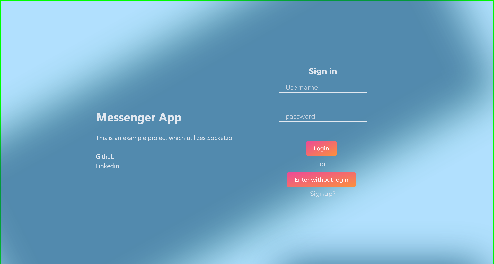

# Messenger App




Messenger web app for real-time communication.

### Backend:
- Express
- Socket.io
- PostgreSQL
- knex
- Jest for testing

### Frontend:
- React
- Redux
- TailwindCSS
- Vitest + testing-library for testing

### How to run

```
cd client
pnpm i
pnpm build

cd ../server
pnpm i
pnpm start
```

Notes:

- At this moment the project is under developemnt
- [Demo](https://messengerapp-627o.onrender.com)